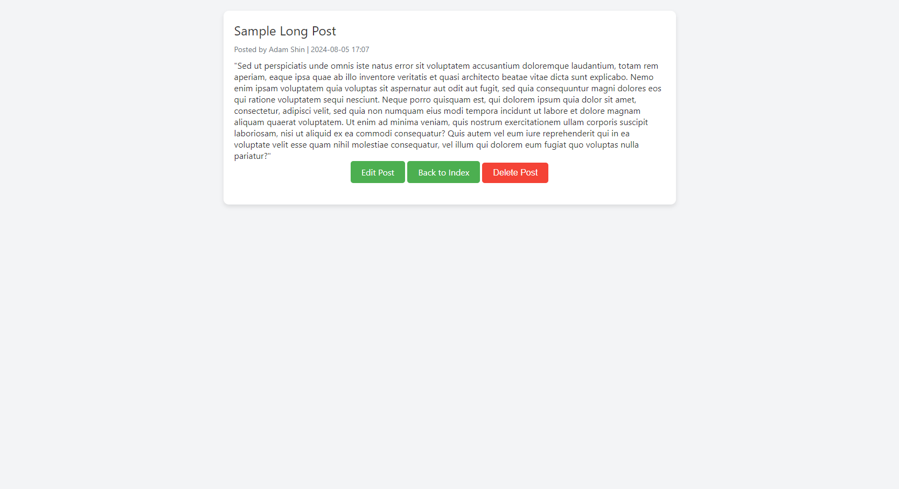
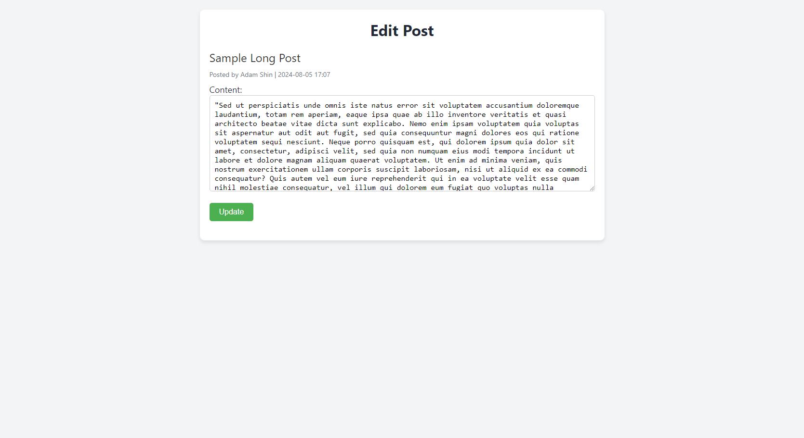

# 🏸📊 [Forum](https://forum-project-l0jb.onrender.com)

## Uptime ⏰

This application is deployed on Render. It will take ~1 minute to launch on first access. Will stay up for 10 minutes.

## Technology Stack and Features

- ⚡ [FastAPI](https://fastapi.tiangolo.com) for the Python backend API.
    - 🧰 [SQLAlchemy](https://www.sqlalchemy.org) for the Python SQL database interactions (ORM).
    - 🔍 [Pydantic](https://docs.pydantic.dev), used by FastAPI, for the data validation and settings management.
- 🌐 HTML for the frontend.
    - 🎨 CSS for responsive design.
- ☁️ [Render](https://render.com/) web service launch.

## Description

A simple web application that can be used as a forum, or to-do list. Demonstrates CRUD Functionality.

## Screenshots

### Home

### Create Post

### Read / Delete Post

### Edit Post

